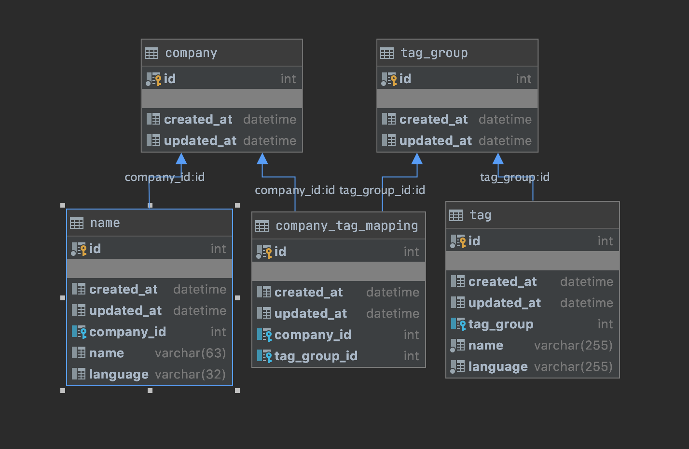

# wanted-homework

## API Spec

| http_method | path     | args | body                           | description |
| ----------- | -------- | ---- | ------------------------------ | ------------------------------ |
| POST        | /api/tag |      | {company_id: int, tag_id: int} |회사 태그 생성|
| DELETE      | /api/tag |      | {company_id: int, tag_id: int} |회사 태그 삭제|
| GET |/api/search|?name=str||이름으로 회사 검색|
| GET |/api/search|?tag=str||태그로 회사 검색|

## Table Structure

